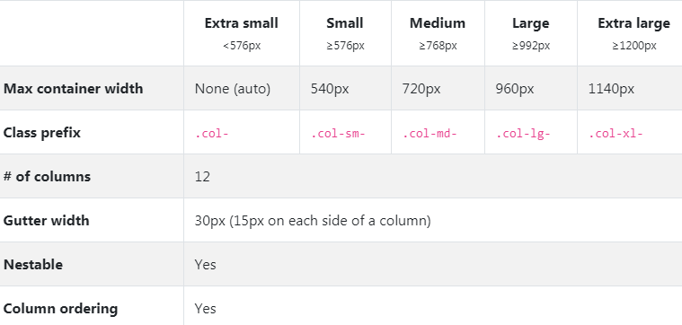
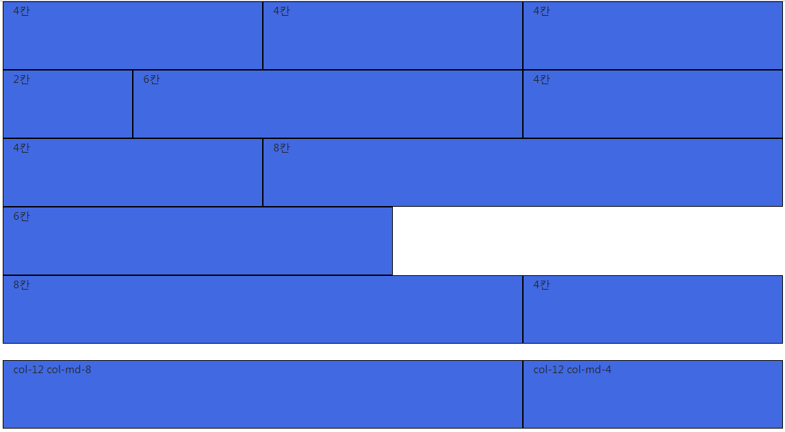
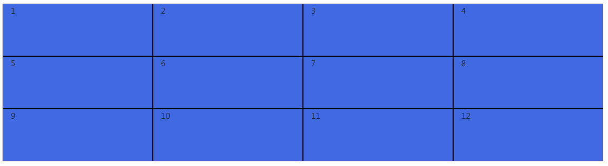
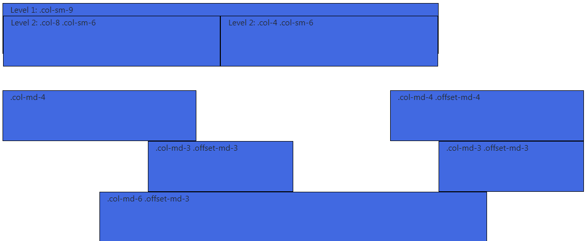
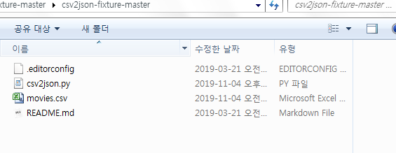

## 2019.11.04
##  Bootstrap

- Bootstrap vs Materialize
	- https://getbootstrap.com/
	- https://materializecss.com/ 
- CDN ? Content Delivery(Distribution) Network
	- 컨텐츠(CSS,JS,Image,Text등)을 효율적으로 전달하기 위해 여러 노드에 가진 네트워크에 데이터를 제공하는 시스템
	- 개별 end-user의 가까운 서버를 통해 빠르게 전달 기능(지리적 이점)
- Spacing	
	- `.m-0` = margin:0 과 같다....등
	- 브라우저 기본 rem 16px
- 실습
```html
<!DOCTYPE html>
<html lang="en">
<head>
  <meta charset="UTF-8">
  <meta name="viewport" content="width=device-width, initial-scale=1.0">
  <meta http-equiv="X-UA-Compatible" content="ie=edge">
  <title>Document</title>
  <link rel="stylesheet" href="https://stackpath.bootstrapcdn.com/bootstrap/4.3.1/css/bootstrap.min.css" integrity="sha384-ggOyR0iXCbMQv3Xipma34MD+dH/1fQ784/j6cY/iJTQUOhcWr7x9JvoRxT2MZw1T" crossorigin="anonymous">
<style>
div {
    width:100px;
    height:100px;
    background-color:royalblue;
}
.sticky{
  width: 100%;
  height: 30px;
}
</style>
</head>
<body>
 <!--1. Spacing -->
<div class="mt-3">mt-3 (margin top)</div>
<div class="p-2 mt-3">p-2 mt-3 (padding, margin top)</div>
<div class="mt-2 mx-auto">mx-auto, 가운데정렬</div>
<div class="mt-2 p-3 ml-auto">ml-auto, 오른쪽정렬</div>
<div class="mt-2 p-3 mr-auto">mr-auto, 왼쪽정렬</div>
<!--2. colors -->
<div class="mt-2 p-2 bg-primary">bg-primary</div>
<div class="m-3 mx-auto bg-success text-light">mx-auto,가운데정렬</div>
<div class="mx-auto bg-info">mx-auto, 가운데정렬</div>
<div class="ml-auto bg-dark text-white">ml-auto,오른쪽정렬</div>
<div class="mr-auto bg-warning">mr-auto,왼쪽정렬</div>
<!--3. Border-->
<div class="my-3 bg-warning mx-auto border border-danger"></div>
<div class="mt-2 p4 bg-success text-white border-bottom border-warning">bg-success</div>
<div class="m-3 mx-auto bg-secondary text-warning rounded-circle">rounded-circle</div>
<div class="mt-2 mx-auto bg-success rounded-pill">rounded-pill</div>
<!--4. Display-->
<span class="d-block">span 태그는 기본적으로 inline</span>
<span class="">하이하이</span>

<div class="mt-4 d-sm-none d-md-block">보이나</div>
<div class="mt-4 d-none d-xl-block">보이니?</div>
<!--5. Position-->
<div class="sticky fixed-top bg-success"></div>
<div class="sticky fixed-bottom bg-warning"></div>
<!--6. Text-->
<div class="mt-3 border border-danger text-right font-italic">text-right!</div>
<div class="mt-2 border text-center font-weight-bold">text-center!</div>

<script src="https://code.jquery.com/jquery-3.3.1.slim.min.js" integrity="sha384-q8i/X+965DzO0rT7abK41JStQIAqVgRVzpbzo5smXKp4YfRvH+8abtTE1Pi6jizo" crossorigin="anonymous"></script>
<script src="https://cdnjs.cloudflare.com/ajax/libs/popper.js/1.14.7/umd/popper.min.js" integrity="sha384-UO2eT0CpHqdSJQ6hJty5KVphtPhzWj9WO1clHTMGa3JDZwrnQq4sF86dIHNDz0W1" crossorigin="anonymous"></script>
<script src="https://stackpath.bootstrapcdn.com/bootstrap/4.3.1/js/bootstrap.min.js" integrity="sha384-JjSmVgyd0p3pXB1rRibZUAYoIIy6OrQ6VrjIEaFf/nJGzIxFDsf4x0xIM+B07jRM" crossorigin="anonymous"></script>

</body>
</html>
```
- Grid options

- 실습
	- 1_grid_system.html
```html
<!DOCTYPE html>
<html lang="en">
<head>
  <meta charset="UTF-8">
  <meta name="viewport" content="width=device-width, initial-scale=1.0">
  <meta http-equiv="X-UA-Compatible" content="ie=edge">
  <title>Document</title>
  <link rel="stylesheet" href="https://stackpath.bootstrapcdn.com/bootstrap/4.3.1/css/bootstrap.min.css" integrity="sha384-ggOyR0iXCbMQv3Xipma34MD+dH/1fQ784/j6cY/iJTQUOhcWr7x9JvoRxT2MZw1T" crossorigin="anonymous">
  <style>
  .square {
    width: 100px;
    height: 100px;
    background-color: royalblue;
    border: 1px solid black;
  }
  </style>
</head>
<body>
<!--7. Grid -->
<!--container-fluid:화면 꽉차게 나눔-->
<div class="container">
  <div class="row">
    <div class="square col-4">4칸</div>
    <div class="square col-4">4칸</div>
    <div class="square col-4">4칸</div>
  </div>
  <div class="row">
    <div class="square col-2">2칸</div>
    <div class="square col-6">6칸</div>
    <div class="square col-4">4칸</div>
  </div>
  <div class="row">
    <div class="square col-4">4칸</div>
    <div class="square col-8">8칸</div>
  </div>
  <div class="row">
    <div class="square col-6">6칸</div>
    <div class="square col-8">8칸</div>
    <div class="square col-4">4칸</div>
  </div>
</div>
<br>
<div class="container">
  <div class="row">
    <div class="square col-12 col-md-8">col-12 col-md-8</div>
    <div class="square col-12 col-md-4">col-12 col-md-4</div>
  </div>
</div>
<br>
<!--[실습] 12개의 div 배분하기-->
<!--기본적으로 한줄에 1개, sm 2개, md 3개, lg 4개, xl 6개 -->
<div class="container">
<div class="row">
  <div class="square col-12 col-sm-6 col-md-4 col-lg-3 col-lg-2" >1</div>
  <div class="square col-12 col-sm-6 col-md-4 col-lg-3 col-lg-2" >2</div>
  <div class="square col-12 col-sm-6 col-md-4 col-lg-3 col-lg-2" >3</div>
  <div class="square col-12 col-sm-6 col-md-4 col-lg-3 col-lg-2" >4</div>
  <div class="square col-12 col-sm-6 col-md-4 col-lg-3 col-lg-2" >5</div>
  <div class="square col-12 col-sm-6 col-md-4 col-lg-3 col-lg-2" >6</div>
  <div class="square col-12 col-sm-6 col-md-4 col-lg-3 col-lg-2" >7</div>
  <div class="square col-12 col-sm-6 col-md-4 col-lg-3 col-lg-2" >8</div>
  <div class="square col-12 col-sm-6 col-md-4 col-lg-3 col-lg-2" >9</div>
  <div class="square col-12 col-sm-6 col-md-4 col-lg-3 col-lg-2" >10</div>
  <div class="square col-12 col-sm-6 col-md-4 col-lg-3 col-lg-2" >11</div>
  <div class="square col-12 col-sm-6 col-md-4 col-lg-3 col-lg-2" >12</div>
</div>
</div>
<br>
<!--Nesting 중첩사용-->
<div class="container">
    <div class="row">
      <div class="square col-sm-9">
        Level 1: .col-sm-9
        <div class="row">
          <div class="square col-8 col-sm-6">
            Level 2: .col-8 .col-sm-6
          </div>
          <div class="square col-4 col-sm-6">
            Level 2: .col-4 .col-sm-6
          </div>
        </div>
      </div>
    </div>
  </div>
  <br><br><br>
<!--Offset classes-->
<div class="container">
    <div class="row">
      <div class="square col-md-4">.col-md-4</div>
      <div class="square col-md-4 offset-md-4">.col-md-4 .offset-md-4</div>
    </div>
    <div class="row">
      <div class="square col-md-3 offset-md-3">.col-md-3 .offset-md-3</div>
      <div class="square col-md-3 offset-md-3">.col-md-3 .offset-md-3</div>
    </div>
    <div class="row">
      <div class="square col-md-8 offset-md-2">.col-md-6 .offset-md-3</div>
    </div>
  </div>

<script src="https://code.jquery.com/jquery-3.3.1.slim.min.js" integrity="sha384-q8i/X+965DzO0rT7abK41JStQIAqVgRVzpbzo5smXKp4YfRvH+8abtTE1Pi6jizo" crossorigin="anonymous"></script>
<script src="https://cdnjs.cloudflare.com/ajax/libs/popper.js/1.14.7/umd/popper.min.js" integrity="sha384-UO2eT0CpHqdSJQ6hJty5KVphtPhzWj9WO1clHTMGa3JDZwrnQq4sF86dIHNDz0W1" crossorigin="anonymous"></script>
<script src="https://stackpath.bootstrapcdn.com/bootstrap/4.3.1/js/bootstrap.min.js" integrity="sha384-JjSmVgyd0p3pXB1rRibZUAYoIIy6OrQ6VrjIEaFf/nJGzIxFDsf4x0xIM+B07jRM" crossorigin="anonymous"></script>

</body>
</html>
```









## Seed Data(Initial Data) 입력하기

#### 1. 이미 데이터가 있을 경우
- dumpdata 명령어를 통해서 현재 앱에서 가지고 있는 데이터를 빼낼 수 있다
```bash
#05_django에서 가상환경 진입
$ source ~/venv/Scripts/activate
#05_django/10_django_movie_project
$ python manage.py dumpdata > movies.json
```
- shift + alt +f : 포맷 정렬변경

#### 2. 준비해준 fixture 데이터들을 넣고 싶을 경우
- CSV (Comma-Seperated Values)
	- 데이터들을 콤마(,)로 구분해서 비교적 간단한 텍스트 형태의 포맷으로 바꾼 형식
	- 스프레드시트, 엑셀에서 주로 활용(데이터 크기 축소)
- `fixture`는 장고가 데이터베이스에 import할 수 있는 데이터의 모음
	- JSON, XML, YAML 포맷의 fixture들을 불러올 수 있다
##### 실습
- sqlite에 저장되어 있는 데이터 dumpdata 이용하여 추출
- 추출한 장고에서 모델링한 데이터가 어떻게 생겼는지 확인
```json
[
    {
        "model": "movies.movie",
        "pk": 1,
        "fields": {
            "title": "\ub9d0\ubaa8\uc774",
            "title_en": "MAL\u00b7MO\u00b7E: The Secret Mission",
            "audience": 2224910,
            "open_date": "2019-01-08T15:00:00Z",
            ...
        }
    }
]
```
- csv -> json 변환 파이썬 소스 다운
(https://github.com/educiao-hphk/csv2json-fixture)

- csv2json-fixture 압축해제 후 > 변환할 csv파일을 압축 푼 폴더에 넣은 후 


- 명령어를 입력하여 csv 파일을 json형식으로 변환
```bash
student@M150119 MINGW64 /c/TIL/csv2json-fixture-master/csv2json-fixture-master (master)
$ python csv2json.py movies.csv movies.Movie
Converting movies.csv from CSV to JSON as movies.json
```

- 05_django/10_django_movie_project/movies/fixtures 폴더에 생성된 movies.json 저장
```bash
#05_django/10_django_movie_project
$ python manage.py loaddata movies.json
```

#### 3. 장고가 Fixture 파일을 찾는 방식
- 기본적으로 애플리케이션 안에 있는 fixtures라는 디렉토리를 탐색한다
```
- movies_pjt/
- config/
- movies/
	- fixtures/
		- movies.json
```
- 환경설정에 `FIXTURE_DIRS` 옵션을 통해 장고가 바라보는 또 다른 디렉토리를 정의할 수 있다.
	- loaddata 명령어를 수행할 때, 다른 경로보다 우선으로 탐색한다

