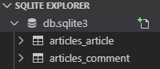

## RESTful API
> HTTP URI를 통해 자원(URI)을 명시하고, HTTP Method(GET,POST,PUT,DELETE)를 통해 해당 자원에 대한 CRUD 로직을 적용하는 것

> 자원(URI), 행위(HTTP Method), 표현(Representations)

> 불필요한 행위는 정의하지 않는다
- REST 핵심 구성요소
	- 1.자원(Resource):URI
	- 2.행위(Verb): HTTP Method
- REST API 디자인 가이드
	
    - URI는 **정보의 자원**을 표현해야 한다

	```bash
	#URI는 자원을 표현하는데 중점을 둔다. 따라서 show, read와 같은 행위에 대한 표현이 들어가서는 안된다

	GET /articles/show/1 (X)
	GET /articles/1 (O)
	```
    - 자원에 대한 행위는 HTTP Method로 표현한다
    ```bash
    #GET Method는 리소스 생성/삭제 등의 행위에는 어울리지 않는다

    GET /articles/1/update (X)
    PUT /articles/1 (O)
	```
	- But! Django에서는 PUT,DELETE와 같은 비공식적 요청을 default로 지원하지 않고 있기 때문에 어느정도의 절충안이 필요
	```bash
	GET /articles/2/update
	```

- 어플리케이션 내에 정의되어 있는 url 목록 조회
```bash
#05_django/10_django_movie_project
$ python manage.py show_urls
```
#### RESTful 구조로 변경 실습
- 05_DJANGO > 03_django_crud > articles 위치에서
- views.py :기존 create 함수 로직 수정
	
```python
def create(request):
    if request.method == 'POST':
        #POST 요청일 경우 -> 게시글 생성 로직 수행
        title = request.POST.get('title')
        content = request.POST.get('content')

        article = Article(title=title, content=content)
        article.save()
    
        return redirect('articles:index')
    else:
        #GET 요청일 경우 -> 폼 보여주기
        return render(request,'articles/create.html')
```
- views.py :기존 update 함수 로직 수정
```python
def update(request, article_pk):
    article = Article.objects.get(pk=article_pk)

    if request.method == 'POST':        
        article.title = request.POST.get('title')
        article.content = request.POST.get('content')
        article.save()
        #return redirect(f'/articles/{article.pk}/')
        return redirect('articles:detail',article_pk)
    else:
        context = {'article': article}
        return render(request, 'articles/update.html', context)
```
- index.html 수정
- 기존 new.html => create.html 파일명 변경
```django html






<h1 class='text-center'>Articles</h1>
<a href="">[NEW]</a>


<hr>
<p> [{{ article.pk }}] {{ article.title }}</p>
<a href="">[DETAIL]</a>


```
- 기본 edit.html => update.html로 파일명 변경
- detail.html 수정
```django html



<h1 class="text-center">DETAIL </h1>
<P>글 번호:{{article.pk}}</P>
<P>글 제목:{{article.title}}</P>
<P>글 내용:{{article.content}}</P>
<P>생성시각:{{article.created_at}}</P>
<P>수정시각:{{article.updated_at}}</P>
<hr>
<a href="">[BACK]</a>
<a href="">[EDIT]</a>
<form action="" method="POST" style="display:inline;" onclick="return confirm('정말로 삭제하시겠습니까?');">

<input type="submit" value="DELETE">
</form>

```

## 1:N Relation
- Foreign Key (외래키)
	- 참조키의 값으로는 부모 테이블에 존재하는 키의 값만을 넣을 수 있다
	참조 무결성을 위해 참조 키를 사용하여 부모 테이블의 유일한 값을 참조한다.
	(부모 테이블의 기본키를 참조)
	- 참조 키의 값이 부모 테이블의 기본키일 필요는 없지만 유일해야 한다
#### 1. Modeling
- possible values for on_delete
	- CASECADE : 부모 객체가 삭제되면 참조하는 객체도 삭제
	- PROTECT: 참조가 되어 있는 경우 오류발생
	- SET_NULL: 부모 객체가 삭제되면 모든 값을 NULL로 치환(NOT NULL 조건이면 불가능)
	- SET_DEFAULT: 모든 값이 DEFAULT 값으로 치환( 해당 값이 DEFAULT 값이 지정되어 있어야 함)
	- SET() :특정 함수 호출
	- DO_NOTHING: 아무것도 하지 않는다. 다만 DB 필드에 대한 SQL `ON DELETE` 제한 조건이 설정되어 있어야 한다.

#### 2. ORM 실습
- 05_DJANGO > 03_django_crud > articles 위치에서
- models.py : Comment 함수추가
```python
from django.db import models

# Create your models here.
class Article(models.Model):
    title = models.CharField(max_length=40)
    content = models.TextField()
    created_at = models.DateTimeField(auto_now_add=True)
    updated_at = models.DateTimeField(auto_now=True)

    #객체 표시 형식 수정
    def __str__(self):
        return f'[{self.pk}] {self.title}'
        
class Comment(models.Model):    
    article = models.ForeignKey(Article, on_delete=models.CASCADE)
    content = models.CharField(max_length=250)
    created_at = models.DateTimeField(auto_now_add=True)
    updated_at = models.DateTimeField(auto_now=True)

    #Model Level에서 Metadata 설정
    class Meta:
        ordering = ['-pk',] #정렬설정
    
    def __str__(self):
        return self.content

```

- db생성
```bash
#05_django/03_django_crud (master)
$ python manage.py makemigrations
Migrations for 'articles':
  articles\migrations\0002_comment.py
    - Create model Comment
(venv)
#05_django/03_django_crud (master)
$ python manage.py migrate
Operations to perform:
  Apply all migrations: admin, articles, auth, contenttypes, jobs, sessions, students
Running migrations:
  Applying articles.0002_comment... OK
(venv)
```
- models.py 수정 : ForeignKey 추가
```python
class Comment(models.Model):
    article = models.ForeignKey(Article, on_delete=models.CASCADE)
    ...
```

-  makemigrations
```bash
#05_django/03_django_crud (master)
$ python manage.py makemigrations
You are trying to add a non-nullable field 'article' to comment without a default; we can't do that (the database needs something to populate existing rows).
Please select a fix:
 1) Provide a one-off default now (will be set on all existing rows with a null value for this column)
 2) Quit, and let me add a default in models.py
Select an option: 1
Please enter the default value now, as valid Python
The datetime and django.utils.timezone modules are available, so you can do e.g. timezone.now
Type 'exit' to exit this prompt
>>> 1
Migrations for 'articles':
  articles\migrations\0003_comment_article.py
    - Add field article to comment
#05_django/03_django_crud (master)
$ python manage.py migrate
```



- shell_plus 실행
```bash
#05_django/03_django_crud (master)
$ python manage.py shell_plus

In []: article = Article.objects.get(pk=1)
In []: comment = Comment()
In []: comment.content = 'hihi...'
In []: comment.article = article
In []: comment.save()

In []: Comment.objects.all()
Out[]: <QuerySet [<Comment: hihi...>]>

In []: comment.article.pk
Out[]: 1

In []: comment.article.title
Out[]: '1111'

In []: comment = Comment(article=article,content='comment test')
In []: comment.save()

```
- admin 사이트에 comment 추가
	- admin.py :CommentAdmin 함수 추가
```python
from django.contrib import admin
from .models import Article
from .models import Comment

# Register your models here.
class ArticleAdmin(admin.ModelAdmin):
    list_display = ('pk','title','content','created_at','updated_at')

class CommentAdmin(admin.ModelAdmin):
    list_display = ('pk','content','created_at','updated_at')

admin.site.register(Article, ArticleAdmin)
admin.site.register(Comment, CommentAdmin)

```

- 사용할 수 있는 함수 확인
```bash
In []: dir(article)
Out[]: 
['DoesNotExist',
 'MultipleObjectsReturned',
 '__class__',
 '__delattr__',
 '__dict__',
 '__dir__',
 '__doc__',
 '__eq__',
 '__format__',
 ...
 ]
 
In []: comments = article.comment_set.all()

In []: comments
Out[]: <QuerySet [<Comment: comment test>, <Comment: hihi...>]>
```

- models.py
```python
class Comment(models.Model):
    #related_name : 부모 테이블에서 역으로 참조할때 기본적으로 모델이름_set 형식으로 불러온다. 
    #related_name이라는 값을 설정해서 _set 명령어를 임의로 변경할 수 있다
    #article = models.ForeignKey(Article, on_delete=models.CASCADE, related_name='comments')
	...
```
