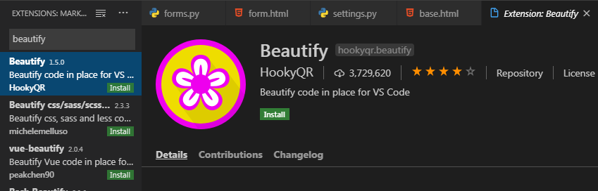

# 19.11.06(수) Django Form

## 0. Image Resizing

* Python & Django 이미지 관련 라이브러리

  ```bash
  # 설치 순서 주의! (의존성 있음)
  
  $ pip install Pillow
  $ pip install pilkit
  $ pip install django-imagekit
  ```

  * `Pillow` : PIL(Python Image Library) 프로젝트에서 fork 되어서 나온 라이브러리. PIL은 Python3를 지원하지 않기 때문에 Pillow를 많이 씀
  * `pilkit` : Pillow를 쉽게 쓸 수 있도록 도와주는 라이브러리. 다양한 Processors 지원
    * Thumbnail
    * Resize
    * Crop ...
  * `django-imagekit` : 이미지 썸네일 Helper

* **INSTALLED_APPS 등록**

  ```python
  # settings.py
  INSTALLED_APPS = [
      ...
      'imagekit',
      ...
  ]
  ```

* 모델 수정

  ```python
  class Article(models.Model):
      ...
      # image = models.ImageField(blank=True)
      image = ProcessedImageField(
          processors=[Thumbnail(200, 300)],   # 처리할 작업
          format='JPEG',                  # 이미지 포맷
          options={'quality': 90},        # 각종 추가 옵션
          upload_to='articles/images',    # 저장 위치
          # 실제 경로 -> MEDIA_ROOT/articles/images
      )
      ...
  ```

* Migration

  ```bash
  $ python manage.py makemigrations
  $ python manage.py migrate
  ```

  * `ProcessedImageField`의 인자로 들어가는 옵션들은 수정을 하더라도 다시 migration 하지 않아도 바로바로 적용이 된다.


## 1. 사전 준비

> Django Form을 적용하기 전, 이때까지 우리가 학습했던 HTML Form으로 앱을 구현해보자.

* **프로젝트 생성**

  ```bash
  $ mkdir 04_django_form
  $ cd 04_django_form
  ```

  ```bash
  $ django-admin startproject config .
  ```

* **앱 생성**

  ```bash
  $ python manage.py startapp articles
  ```

* **Article Model**

  ```python
  # models.py
  from django.db import models
  
  class Article(models.Model):
      title = models.CharField(max_length=40)
      content = models.TextField()
      created_at = models.DateTimeField(auto_now_add=True)
      updated_at = models.DateTimeField(auto_now=True)
  
      # 객체 표시 형식 
      def __str__(self):
           return f'[{self.pk}번글]: {self.title}|{self.content}'
  ```

* **URL 설정**

  ```python
  # config/urls.py
  from django.contrib import admin
  from django.urls import path, include
  
  urlpatterns = [
      path('articles/', include('articles.urls')),
      ...
  ]
  ```

  ```python
  # articles/urls.py
  from django.urls import path
  from . import views
  
  app_name = 'articles'
  urlpatterns = [
      path('', views.index, name='index'),
      path('create/', views.create, name='create'),
      path('<int:article_pk>/', views.detail, name='detail'),
      path('<int:article_pk>/delete/', views.delete, name='delete'),
      path('<int:article_pk>/update/', views.update, name='update'),
  
  ]
  ```

* **base.html 생성** (부트스트랩 적용X)

* **Index 페이지** (-> 모든 게시글 보여주기)

  ```python
  # views.py
  def index(request):
      pass
  ```

  ```html
  <!-- index.html -->
  ```

* **Create 페이지**

  ```python
  # views.py
  def create(request):
      pass
  ```

  ```html
  <!-- create.html -->
  ```

* **Detail 페이지**

  ```python
  # views.py
  def detail(request, article_pk):
      pass
  ```

  ```html
  <!-- detail.html -->
  ```

  

## 2. Django Form

> Django에서 제공하는 Form 클래스를 이용해서 편리하게 폼 정보를 관리하고 유효성 검증을 진행하고, 비유효 field에 대한 에러 메시지를 결정한다.
>
> 즉, HTML으로 Form 입력을 관리하던 것을 Django에서 제공하는 Form 클래스로 바꿔보는 작업을 해보자.

* **Form의 장점 (-> 자동화)**
  * `blank=True` 와 같은 옵션을 따로 지정해주지 않았으면, HTML 태그에 required 옵션 자동으로 붙여준다.
  * 기존에 max_length와 같은 조건을 어길 경우 에러 페이지를 출력했는데, Django Form을 써서 에러 메시지를 출력해준다.

```python
# views.py

def create(request):
    # POST 요청 -> 데이터를 받아서 DB에 저장
    if request.method == 'POST':
        # Binding 과정
        # 폼 인스턴스를 생성하고, 전달받은 데이터를 채운다.
        # 인스턴스에 데이터를 채워서, 유효성 검증을 진행한다.
        form = ArticleForm(request.POST)
        embed()
        if form.is_valid():
            # cleaned_data를 통해 딕셔너리 안 데이터를 검증한다.
            title = form.cleaned_data.get('title')
            content = form.cleaned_data.get('content')
            article = Article.objects.create(title=title, content=content)
        return redirect('articles:detail', article.pk)
    else:
        form = ArticleForm()

    # form으로 전달받는 형태가 2가지
    # 1. GET요청 -> 비어있는 폼 전달
    # 2. 유효성 검증 실패 -> 에러 메시지를 포함한 채로 폼 전달
    context = {'form': form}
    return render(request, 'articles/create.html', context)
```

```
In [1]: form
Out[1]: <ArticleForm bound=True, valid=Unknown, fields=(title;content)>

In [2]: request.POST
Out[2]: <QueryDict: {'csrfmiddlewaretoken': ['U1J7RiHKAesPTziSAwvboujPOKqSrouK01pu2DMCXZ6EgiSDLwjJehiLLhOMzHsl'], 'title': ['dfsdfsd'], 'content': ['sdfsdf']}>

In [3]: type(form)
Out[3]: articles.forms.ArticleForm

In [4]: form.is_valid()
Out[4]: True

In [5]: form
Out[5]: <ArticleForm bound=True, valid=True, fields=(title;content)>

In [6]: form.cleaned_data
Out[6]: {'title': 'dfsdfsd', 'content': 'sdfsdf'}

In [7]: type(form.cleaned_data)
Out[7]: dict

In [8]: form.cleaned_data.get('title')
Out[8]: 'dfsdfsd'

In [9]: exit()
```

```html
<form action="" method="POST">
    
    {{ form.as_p }}
    <input type="submit">
</form>
```

### get_object_or_404

* 500 에러는 내부 서버 오류로, '서버에 오류가 발생하여 요청을 처리할 수 없다'는 의미다. 예를 들어 articles/38513858135와 같이 존재하지 않는 상세정보 페이지를 요청하면 500 에러가 발생한다.
* 하지만 이 경우엔 사용자의 요청이 잘못된 경우이기 때문에 '서버에 존재하지 않는 페이지에 대한 요청'이라는 의미를 가진 404 에러를 돌려주어야 한다.
  * 500 에러를 돌려주면 "선생님, 깃헙 폭파됐는데요?"라는 말이 나올거고, 404 에러를 돌려주면 "아, 선생님이 주소를 잘못 줬거나 내가 잘못 쳤구나..."라는 말이 나올 것.

```python
# views.py
from django.shortcuts import render, redirect, get_object_or_404

def detail(request, article_pk):
    article = get_object_or_404(Article, pk=article_pk)
    context= {'article': article}
    return render(requestm 'articles/detail.html', context)
```

## 3. Django ModelForm
- 개념
	- Django의 큰 특징 중 하나
	- Model 클래스 정의와 비슷하게 Form 클래스를 선언할 수 있다
- 역할
	- HTML 입력 폼 생성: as_p(), as_table()
	- 유효성 검증: is_valid()
	- 검증 통과한 값 딕셔너리로 제공: cleaned_data
- Form v ModelForm
```python
# ModelForm
# 1. ModelForm 클래스를 상속받아 사용한다
# 2. 메타데이터로 Model정보를 건네주면, ModelForm이 자동으로 field에 맞춰 input을 생성해준다
class ArticleForm(forms.ModelForm):
    #메타데이터 :  데이터의 데이터
    #ex) 사진 한장 (촬영장비이름, 촬영환경 등)
    title = forms.CharField(
        label='제목',
        max_length=10,
        widget=forms.TextInput(
            attrs={
                'class':'title',
                'placeholder':'제목입력'
            }
        )
    )
    content = forms.CharField(
        label='내용',
        max_length=10,
        widget=forms.Textarea(
            attrs={
                'class':'content',
                'placeholder':'내용입력',
                'rows':5,
                'cols':30
            }
        )
    )
    class Meta:
        model = Article
        fields = '__all__' #전체가져오기
        #fields = ('title','content',) #선택해서 데이터 가져오기

```

---
# 2019.11.07 Django Form
## URL Resolver
- 사용자가 요청한 URL과 장고 내부로 들어오는 URL 사이에서 번역 역할을 해준다.
- form.html 수정
```django





  <h1>CREATE</h1>

  <h1>UPDATE</h1>
  
  <hr>
<!--
  action 값이 공백일 경우, 현재 위치하고 있는 주소로 요청을 보낸다. 폼을 던져주는 경로,
  DB에 저장하는 경로가 동일하다면 공백으로 해도 정상적으로 동작한다.
-->
<form action="" method="POST">
<!-- POST 요청할 때 반드시 설정 -->
   
  {{ form.as_p }}

  <input type="submit">
</form>
<hr>

  <a href="">[BACK]</a>

  <a href="">[BACK]</a>
  


```
- views.py 수정
```python
def update(request, article_pk):
    article = get_object_or_404(Article,pk=article_pk)
    
    if request.method == "POST":
        form = ArticleForm(request.POST, instance=article)
        if form.is_valid():
            article = form.save()           
            return redirect('articles:detail', article.pk)
    else:
        form = ArticleForm(instance=article)       
        
    # context로 전달되는 2가지 form 형식
    # 1. GET -> 초기값을 폼에 넣어서 사용자에게 던져줌
    # 2. POST -> is_valid가 False가 리턴됬을 때, 오류 메세지를 포함해서 동작한다.
    context = {
        'form':form,
        'article':article
    }
    return render(request, 'articles/form.html', context)
```

## django bootstrap 적용
- bootstrap 설치 (https://django-bootstrap4.readthedocs.io/en/latest/)
```bash
$ pip install django-bootstrap4
```
- settings.py
```python
INSTALLED_APPS = [
   	...
    'bootstrap4',
    ...
]
```
- base.html 수정
  -  추가
  -  추가
```django


<!DOCTYPE html>
<html lang="en">
<head>
  <meta charset="UTF-8">
  <meta name="viewport" content="width=device-width, initial-scale=1.0">
  <meta http-equiv="X-UA-Compatible" content="ie=edge">
  <title>04_django_form</title>

</head>
<body>

  <div class="container">
    
    
  </div>


</body>
</html>
```
- form.html 수정
	-  추가
	-  추가
	- 버튼 수정
	```
	
	```
```django






  <h1>CREATE</h1>

  <h1>UPDATE</h1>
  
  <hr>
<!--
  action 값이 공백일 경우, 현재 위치하고 있는 주소로 요청을 보낸다. 폼을 던져주는 경로,
  DB에 저장하는 경로가 동일하다면 공백으로 해도 정상적으로 동작한다.
-->
<form action="" method="POST">
<!-- POST 요청할 때 반드시 설정 -->
   
  
  <div class="text-center">
  
  </div>
</form>
<hr>

  <a href="">[BACK]</a>

  <a href="">[BACK]</a>
  


```

## VS Code mode 변경 세팅
- beautify 설치

- ctrl + shift + p >  settings.py
- alt + shift + f

## Comment - ModelForm
- Comment Model 생성

  ```python
  from django.db import models
  
  ...
  
  class Comment(models.Model):
      article = models.ForeignKey(Article, on_delete=models.CASCADE)
  
      content = models.TextField()
      created_at = models.DateTimeField(auto_now_add=True)
      updated_at = models.DateTimeField(auto_now=True)
  
      #Model Level에서 메타데이터 옵션 설정
      #-> 정렬기능 사용
      class Meta:
          ordering = ['-pk',] 
  
      #객체 표현 방식
      def __str__(self):
          return self.content
  ```
- db makemigrations, migrate 실행
```bash
$ python manage.py makemigrations
$ python manage.py migrate
```
