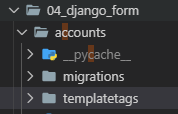

# Django Form

## 0. Image Resizing

* Python & Django 이미지 관련 라이브러리

  ```bash
  # 설치 순서 주의! (의존성 있음)
  
  $ pip install Pillow
  $ pip install pilkit
  $ pip install django-imagekit
  ```

  * `Pillow` : PIL(Python Image Library) 프로젝트에서 fork 되어서 나온 라이브러리. PIL은 Python3를 지원하지 않기 때문에 Pillow를 많이 씀
  * `pilkit` : Pillow를 쉽게 쓸 수 있도록 도와주는 라이브러리. 다양한 Processors 지원
    * Thumbnail
    * Resize
    * Crop ...
  * `django-imagekit` : 이미지 썸네일 Helper

* **INSTALLED_APPS 등록**

  ```python
  # settings.py
  INSTALLED_APPS = [
      ...
      'imagekit',
      ...
  ]
  ```

* 모델 수정

  ```python
  # models.py
  class Article(models.Model):
      ...
      # image = models.ImageField(blank=True)
      image = ProcessedImageField(
          processors=[Thumbnail(200, 300)],   # 처리할 작업
          format='JPEG',                  # 이미지 포맷
          options={'quality': 90},        # 각종 추가 옵션
          upload_to='articles/images',    # 저장 위치
          # 실제 경로 -> MEDIA_ROOT/articles/images
      )
      ...
  ```

* Migration

  ```bash
  $ python manage.py makemigrations
  $ python manage.py migrate
  ```

  * `ProcessedImageField`의 인자로 들어가는 옵션들은 수정을 하더라도 다시 migration 하지 않아도 바로바로 적용이 된다.


## 1. 사전 준비

> Django Form을 적용하기 전, 이때까지 우리가 학습했던 HTML Form으로 앱을 구현해보자.

* **프로젝트 생성**

  ```bash
  $ mkdir 04_django_form
  $ cd 04_django_form
  ```

  ```bash
  $ django-admin startproject config .
  ```

* **앱 생성**

  ```bash
  $ python manage.py startapp articles
  ```

* **Article Model**

  ```python
  # models.py
  from django.db import models
  
  class Article(models.Model):
      title = models.CharField(max_length=40)
      content = models.TextField()
      created_at = models.DateTimeField(auto_now_add=True)
      updated_at = models.DateTimeField(auto_now=True)
  
      # 객체 표시 형식 
      def __str__(self):
           return f'[{self.pk}번글]: {self.title}|{self.content}'
  ```

* **URL 설정**

  ```python
  # config/urls.py
  from django.contrib import admin
  from django.urls import path, include
  
  urlpatterns = [
      path('articles/', include('articles.urls')),
      ...
  ]
  ```

  ```python
  # articles/urls.py
  from django.urls import path
  from . import views
  
  app_name = 'articles'
  urlpatterns = [
      path('', views.index, name='index'),
      path('create/', views.create, name='create'),
      path('<int:article_pk>/', views.detail, name='detail'),
      path('<int:article_pk>/delete/', views.delete, name='delete'),
      path('<int:article_pk>/update/', views.update, name='update'),
  
  ]
  ```

* **base.html 생성** (부트스트랩 적용X)

* **Index 페이지** (-> 모든 게시글 보여주기)

  ```python
  # views.py
  def index(request):
      pass
  ```

  ```html
  <!-- index.html -->
  ```

* **Create 페이지**

  ```python
  # views.py
  def create(request):
      pass
  ```

  ```html
  <!-- create.html -->
  ```

* **Detail 페이지**

  ```python
  # views.py
  def detail(request, article_pk):
      pass
  ```

  ```html
  <!-- detail.html -->
  ```

  

## 2. Django Form

> Django에서 제공하는 Form 클래스를 이용해서 편리하게 폼 정보를 관리하고 유효성 검증을 진행하고, 비유효 field에 대한 에러 메시지를 결정한다.
>
> 즉, HTML으로 Form 입력을 관리하던 것을 Django에서 제공하는 Form 클래스로 바꿔보는 작업을 해보자.

* **Form의 장점 (-> 자동화)**
  * `blank=True` 와 같은 옵션을 따로 지정해주지 않았으면, HTML 태그에 required 옵션 자동으로 붙여준다.
  * 기존에 max_length와 같은 조건을 어길 경우 에러 페이지를 출력했는데, Django Form을 써서 에러 메시지를 출력해준다.

```python
# views.py

def create(request):
    # POST 요청 -> 데이터를 받아서 DB에 저장
    if request.method == 'POST':
        # Binding 과정
        # 폼 인스턴스를 생성하고, 전달받은 데이터를 채운다.
        # 인스턴스에 데이터를 채워서, 유효성 검증을 진행한다.
        form = ArticleForm(request.POST)
        embed()
        if form.is_valid():
            # cleaned_data를 통해 딕셔너리 안 데이터를 검증한다.
            title = form.cleaned_data.get('title')
            content = form.cleaned_data.get('content')
            article = Article.objects.create(title=title, content=content)
        return redirect('articles:detail', article.pk)
    else:
        form = ArticleForm()

    # form으로 전달받는 형태가 2가지
    # 1. GET요청 -> 비어있는 폼 전달
    # 2. 유효성 검증 실패 -> 에러 메시지를 포함한 채로 폼 전달
    context = {'form': form}
    return render(request, 'articles/create.html', context)
```

```
In [1]: form
Out[1]: <ArticleForm bound=True, valid=Unknown, fields=(title;content)>

In [2]: request.POST
Out[2]: <QueryDict: {'csrfmiddlewaretoken': ['U1J7RiHKAesPTziSAwvboujPOKqSrouK01pu2DMCXZ6EgiSDLwjJehiLLhOMzHsl'], 'title': ['dfsdfsd'], 'content': ['sdfsdf']}>

In [3]: type(form)
Out[3]: articles.forms.ArticleForm

In [4]: form.is_valid()
Out[4]: True

In [5]: form
Out[5]: <ArticleForm bound=True, valid=True, fields=(title;content)>

In [6]: form.cleaned_data
Out[6]: {'title': 'dfsdfsd', 'content': 'sdfsdf'}

In [7]: type(form.cleaned_data)
Out[7]: dict

In [8]: form.cleaned_data.get('title')
Out[8]: 'dfsdfsd'

In [9]: exit()
```

```html
<form action="" method="POST">
    
    {{ form.as_p }}
    <input type="submit">
</form>
```

### get_object_or_404

* 500 에러는 내부 서버 오류로, '서버에 오류가 발생하여 요청을 처리할 수 없다'는 의미다. 예를 들어 articles/38513858135와 같이 존재하지 않는 상세정보 페이지를 요청하면 500 에러가 발생한다.
* 하지만 이 경우엔 사용자의 요청이 잘못된 경우이기 때문에 '서버에 존재하지 않는 페이지에 대한 요청'이라는 의미를 가진 404 에러를 돌려주어야 한다.
  * 500 에러를 돌려주면 "선생님, 깃헙 폭파됐는데요?"라는 말이 나올거고, 404 에러를 돌려주면 "아, 선생님이 주소를 잘못 줬거나 내가 잘못 쳤구나..."라는 말이 나올 것.

```python
# views.py
from django.shortcuts import render, redirect, get_object_or_404

def detail(request, article_pk):
    article = get_object_or_404(Article, pk=article_pk)
    context= {'article': article}
    return render(requestm 'articles/detail.html', context)
```

## 3. Django ModelForm
- 개념
	- Django의 큰 특징 중 하나
	- Model 클래스 정의와 비슷하게 Form 클래스를 선언할 수 있다
- 역할
	- HTML 입력 폼 생성: as_p(), as_table()
	- 유효성 검증: is_valid()
	- 검증 통과한 값 딕셔너리로 제공: cleaned_data
- Form v ModelForm
```python
# ModelForm
# 1. ModelForm 클래스를 상속받아 사용한다
# 2. 메타데이터로 Model정보를 건네주면, ModelForm이 자동으로 field에 맞춰 input을 생성해준다
class ArticleForm(forms.ModelForm):
    #메타데이터 :  데이터의 데이터
    #ex) 사진 한장 (촬영장비이름, 촬영환경 등)
    title = forms.CharField(
        label='제목',
        max_length=10,
        widget=forms.TextInput(
            attrs={
                'class':'title',
                'placeholder':'제목입력'
            }
        )
    )
    content = forms.CharField(
        label='내용',
        max_length=10,
        widget=forms.Textarea(
            attrs={
                'class':'content',
                'placeholder':'내용입력',
                'rows':5,
                'cols':30
            }
        )
    )
    class Meta:
        model = Article
        fields = '__all__' #전체가져오기
        #fields = ('title','content',) #선택해서 데이터 가져오기

```

---
## URL Resolver
- 사용자가 요청한 URL과 장고 내부로 들어오는 URL 사이에서 번역 역할을 해준다.
- form.html 수정
```html





  <h1>CREATE</h1>

  <h1>UPDATE</h1>
  
  <hr>
<!--
  action 값이 공백일 경우, 현재 위치하고 있는 주소로 요청을 보낸다. 폼을 던져주는 경로,
  DB에 저장하는 경로가 동일하다면 공백으로 해도 정상적으로 동작한다.
-->
<form action="" method="POST">
<!-- POST 요청할 때 반드시 설정 -->
   
  {{ form.as_p }}

  <input type="submit">
</form>
<hr>

  <a href="">[BACK]</a>

  <a href="">[BACK]</a>
  


```
- views.py 수정
```python
def update(request, article_pk):
    article = get_object_or_404(Article,pk=article_pk)
    
    if request.method == "POST":
        form = ArticleForm(request.POST, instance=article)
        if form.is_valid():
            article = form.save()           
            return redirect('articles:detail', article.pk)
    else:
        form = ArticleForm(instance=article)       
        
    # context로 전달되는 2가지 form 형식
    # 1. GET -> 초기값을 폼에 넣어서 사용자에게 던져줌
    # 2. POST -> is_valid가 False가 리턴됬을 때, 오류 메세지를 포함해서 동작한다.
    context = {
        'form':form,
        'article':article
    }
    return render(request, 'articles/form.html', context)
```

## django bootstrap 적용
- bootstrap 설치 (https://django-bootstrap4.readthedocs.io/en/latest/)
```bash
$ pip install django-bootstrap4
```
- settings.py
```python
INSTALLED_APPS = [
   	...
    'bootstrap4',
    ...
]
```
- base.html 수정
  -  추가
  -  추가
```html


<!DOCTYPE html>
<html lang="en">
<head>
  <meta charset="UTF-8">
  <meta name="viewport" content="width=device-width, initial-scale=1.0">
  <meta http-equiv="X-UA-Compatible" content="ie=edge">
  <title>04_django_form</title>

</head>
<body>

  <div class="container">
    
    
  </div>


</body>
</html>
```
- form.html 수정
	-  추가
	-  추가
	- 버튼 수정
	```
	
	```
```html






  <h1>CREATE</h1>

  <h1>UPDATE</h1>
  
  <hr>
<!--
  action 값이 공백일 경우, 현재 위치하고 있는 주소로 요청을 보낸다. 폼을 던져주는 경로,
  DB에 저장하는 경로가 동일하다면 공백으로 해도 정상적으로 동작한다.
-->
<form action="" method="POST">
<!-- POST 요청할 때 반드시 설정 -->
   
  
  <div class="text-center">
  
  </div>
</form>
<hr>

  <a href="">[BACK]</a>

  <a href="">[BACK]</a>
  


```

## VS Code mode 변경 세팅
- beautify 설치

- ctrl + shift + p >  settings.py
- alt + shift + f

## Comment - ModelForm
- Comment Model 생성

  ```python
  from django.db import models
  
  ...
  
  class Comment(models.Model):
      article = models.ForeignKey(Article, on_delete=models.CASCADE)
  
      content = models.TextField()
      created_at = models.DateTimeField(auto_now_add=True)
      updated_at = models.DateTimeField(auto_now=True)
  
      #Model Level에서 메타데이터 옵션 설정
      #-> 정렬기능 사용
      class Meta:
          ordering = ['-pk',] 
  
      #객체 표현 방식
      def __str__(self):
          return self.content
  ```
- db makemigrations, migrate 실행
    ```bash
    $ python manage.py makemigrations
    $ python manage.py migrate
    ```

- forms.py 수정
  ```python
  class CommentForm(forms.ModelForm):
      content = forms.CharField(
          label='댓글',
          max_length=1000,
          widget=forms.Textarea(
              attrs={
                  'class':'content',
                  'placeholder':'내용입력',
                  'rows':5,
                  'cols':30
              }
          )
      )
      class Meta:
          model = Comment
          fields = '__all__'
  ```

- admin.py 수정
	```python
	from django.contrib import admin
    from .models import Article
    from .models import Comment

    ...

    class CommentAdmin(admin.ModelAdmin):
        list_display = ('pk','content', 'created_at', 'updated_at',)

    admin.site.register(Article, ArticleAdmin)
    admin.site.register(Comment, CommentAdmin)
	```

- views.py 수정: detail 함수에서 comment_form 객체 추가

  ```python
  def detail(request, article_pk):
      # article = Article.objects.get(pk=article_pk)
      article = get_object_or_404(Article, pk=article_pk)
      comment_form = CommentForm()
      context = {
          'article':article,
          'comment_form':comment_form,
          } 
      return render(request, 'articles/detail.html', context)
  ```

- urls.py  수정

  ```python
  urlpatterns = [
    ... path('<int:article_pk>/comments/',views.comments_create,name="comments_create"),    path('<int:article_pk>/comments/<int:comment_pk>/delete',views.comments_delete,name="comments_delete"),
  ]
  ```

- views.py 수정 : comments_create 함수추가

  ```python
  def comments_create(requset, article_pk):
      article = get_object_or_404(Article, pk =article_pk)
      if requset.method == 'POST':
          comment_form = CommentForm(requset.POST)
          if comment_form.is_valid():
              #save 메서드 -> 선택 인자:(기본값) commit=True
              #DB에 바로 저장되는 것을 막아준다
              comment  = comment_form.save(commit=False)
              comment.article = article
              comment.save()
              
              return redirect('articles:detail',article.pk)
      return redirect('articles:detail',article.pk)
  
  def comments_delete(requset, article_pk,comment_pk):
      if requset.method == 'POST':
          comment = Comment.objects.get(pk=comment_pk)
          comment.delete()
          return redirect('articles:detail',article_pk)
      else:
          return redirect('articles:detail',article_pk)
  
  ```

- Detail 화면에 댓글 추가
  
  - detail.html

```html



...
<hr>
<p><b>댓글목록({{comments|length}}개)</b></p>

<p>[{{forloop.revcounter}}번 댓글] {{comment.content}} <small>({{comment.created_at}})</small>
<form action="" method="POST">
<button type="submit" >댓글삭제</button></form>
</p>


```

- views.py

```python
def detail(request, article_pk):
    # article = Article.objects.get(pk=article_pk)
    article = get_object_or_404(Article, pk=article_pk)
    comment_form = CommentForm()
    comments = article.comment_set.all()

    context = {
        'article':article,
        'comment_form':comment_form,
        'comments':comments
        } 
    return render(request, 'articles/detail.html', context)
```

## View Decorators

> Django가 제공하는 Decorator 활용하기

#### require_POST

- view함수가 POST메서드 요청만 승인하도록 하는 데코레이터
- 일치하지 않으면 `405 method Not Allowed` 에러를 발생시킨다

#### 실습

- views.py 수정

  - require_POST import

  - @require_POST

```python
from django.views.decorators.http import require_POST

@require_POST
def delete(request, article_pk):
    article = get_object_or_404(Article,pk=article_pk)
        
    article.delete()
    return redirect('articles:index')
```

# Authentication(인증)

> 장고에서 이미 Auth 관련 기능을 제공함
>
>  `createsuperuser`를 통해 관리자 계정도 만들었고 어드민 페이지에서 로그인 기능 사용 가능

## Accounts 앱생성

- 기존 앱에서 구현해도 되지만 장고에서는 기능 단위로 애플리케이션을 나누는 것이 일반적이므로 accounts라는 새로운 앱을 생성

- accounts 앱 생성

  ```bash
  #05_django/04_django_form (master)
  $ python manage.py startapp accounts
  ```

  

- URL 분리

  ```python
  # 프로젝트내 config > urls.py
  from django.contrib import admin
  from django.urls import path, include
  
  urlpatterns = [
      path('accounts/',include('accounts.urls')),
      ...
  ]
  ```

  ```python
  # accounts > urls.py
  from django.urls import path
  
  urlpatterns = [
    
  ]
  ```

  

## SignUp 기능

- views.py

  ```python
  from django.shortcuts import render,redirect
  from django.contrib.auth.forms import UserCreationForm, AuthenticationForm
  
  # Create your views here.
  #Authentication(인증) -> 신원 확인
  def signup(request):
      if request.user.is_authenticated:
          return redirect('articles:index')
  
      if request.method=='POST':
          form = UserCreationForm(request.POST)
          if form.is_valid():
              user = form.save()
              auth_login(request, user)
              return redirect('articles:index')
      else:
          form = UserCreationForm
      context ={'form':form}
      return render(request,'accounts/signup.html',context)
  ```

## Login 기능

- views.py

  ```python
  from django.shortcuts import render,redirect
  from django.contrib.auth import login as auth_login
  from django.contrib.auth.forms import UserCreationForm, AuthenticationForm
  
  ...
  
  def login(request):
      if request.user.is_authenticated:
          return redirect('articles:index')
  
      if request.method =='POST':
          form = AuthenticationForm(request,request.POST)
          if form.is_valid():
              auth_login(request, form.get_user())
              return redirect('articles:index')
      else:
          form = AuthenticationForm()
      context = {'form':form}
      return render(request,'accounts/login.html',context)
  
  ```

- base.html 수정

  ```html
  
  
  <!DOCTYPE html>
  <html lang="en">
  <head>
    <meta charset="UTF-8">
    <meta name="viewport" content="width=device-width, initial-scale=1.0">
    <meta http-equiv="X-UA-Compatible" content="ie=edge">
    <title>04_django_form</title>
  
  </head>
  <body>
  
    <div class="container">
      
        <h2>어서오세요, {{user.username}}</h2><a href="">로그아웃</a>
      
        <a href="">로그인</a>
        <a href="">회원가입</a>
      
      
      
      
    </div>
  
  
  </body>
  </html>
  ```

  

## Logout  기능

```python
#accounts > views.py
from django.contrib.auth import logout as auth_logout
...

def logout(request):
    auth_logout(request)
    return redirect('articles:index')
```

```python
#accounts > urls.py

from django.urls import path
from . import views

app_name = 'accounts'

urlpatterns = [
    path('signup/',views.signup,name="signup"),
    path('login/',views.login,name="login"),
    path('logout/',views.logout,name="logout"),
]
```

## 사용자 정보 수정  커스텀마이징
- https://github.com/django/django/blob/master/django/contrib/auth/models.py 참고
- accounts > views.py 수정
```python
from .forms import CustomUserChangeForm
from django.contrib.auth.decorators import login_required
...

#회원정보 수정
@login_required #로그인 회원만 접근가능
def update(request):
    if request.method =='POST':
        form = CustomUserChangeForm(request.POST, instance=request.user)
        if form.is_valid():
            form.save()
            return redirect('articles:index')
    else:
        form = CustomUserChangeForm(instance=request.user)

    context = {'form':form}
    return render(request,'accounts/update.html',context)
    
```
- config > templates >  accounts > update.html

```html




<h1></h1>
<hr>
<form action="" method="POST">



</form>

```
- accounts > urls.py
```python
from django.urls import path
from . import views

app_name = 'accounts'
urlpatterns = [
    ...
    path('update/',views.update,name="update"),
]
```

## 비밀번호 변경 기능 추가
```python
from django.contrib.auth.forms import PasswordChangeForm

#비밀번호 변경
def change_password(request):
    if request.method == 'POST':
        form = PasswordChangeForm(request.user, request.POST)
        if form.is_valid():
            form.save()
            return redirect('articles:index')
    else:
        form = PasswordChangeForm(request.user)
    context = {'form':form}
    return render(request,'accounts/change_password.html',context)
```

- change_password.html

```python




<h1>암호변경</h1>
<hr>
<form action="" method="POST">



</form>

```

- urls.py 수정

```python
urlpatterns = [
  ...    path('password/',views.change_password,name="change_password"),
]
```

- 문제점
  - 비밀번호 변경은 잘되는데 변경이 끝나면 로그인이 풀림
  - 비밀번호가 변경되면서 기존 세션과 회원인증 정보가 일치하지 않게 되기 때문에 자동으로 로그아웃 되어 버림
  - `update_session_auth_hash`로 해결하기 (세션유지)

```python
from django.contrib.auth import update_session_auth_hash
...
#비밀번호 변경
@login_required
def change_password(request):
    if request.method == 'POST':
        form = PasswordChangeForm(request.user, request.POST)
        if form.is_valid():
            user = form.save()
            update_session_auth_hash(request, user)
            return redirect('articles:index')
    else:
        form = PasswordChangeForm(request.user)
    context = {'form':form}
    return render(request,'accounts/change_password.html',context)
```

## Auth form 합치기

- auth_form.html 추가

```html





<h1>회원가입</h1>

<h1>로그인</h1>

<h1>회원정보변경</h1>

<h1>비밀번호변경</h1>

<hr>
<form action="" method="POST">



</form>

```

- views.py 수정

  - signup(), login(), update(), change_password() 함수의 return 부분 수정

    ```python
    ...
    return render(request,'accounts/auth_form.html',context)
    ```

    

## Gravatar - 프로필 이미지 만들기

-  https://ko.gravatar.com/ 
- 이메일을 활용해서 프로필 사진을 만들어주는 서비스
- 한번등록하면 이를 지원하는 사이트에서는 모두 해당 프로필 이미지를 사용할 수 있다
- 이메일 체크
  -  https://ko.gravatar.com/site/check
  - 이메일 주소를 해시(MD5)로 바꾸고 URL으로 접속하면 이미지가 뜬다(?s=80 으로 사이즈 조절 가능)

- Python으로 Hash 만들기

  - md5 hash 생성
    
  - import hashlib
    
  - 혹시 모를 공백, 대문자 등을 방지하기 위한 파이썬 문법들
    
  - strip(), lower()
    
  - python shell 실행

    ```python
    import hashlib
    img_url = hashlib.md5('kyungh103@gmail.com'.encode('utf-8').lower().strip()).hexdigest()
    ```

- Custom Template tag and filters
	
	- 어플리케이션 내에 templatetags 폴더 생성

    

	- templatetags 폴더내에 gravatar.py 파일생성
	
	 ```python
	 import hashlib
	 from django import template
	 
	 #기존 템플릿 라이브러리에 새로운 템플릿 추가
	 register = template.Library()
	 
	 #아래 함수를 필터로 등록
	 @register.filter
	 def makemd5(email):
	     return hashlib.md5(email.encode('utf-8').lower().strip()).hexdigest()
	 ```

	- base.html 수정

     ```html
     
     
     <!DOCTYPE html>
     <html lang="en">
     <head>
       <meta charset="UTF-8">
       <meta name="viewport" content="width=device-width, initial-scale=1.0">
       <meta http-equiv="X-UA-Compatible" content="ie=edge">
       <title>04_django_form</title>
     
     </head>
     <body>
     
       <div class="container">
         
           <h2>어서오세요, {{user.username}}</h2>
           <a class="btn btn-outline-primary btn-sm" href="">로그아웃</a>
           <a class="btn btn-outline-primary btn-sm" href=>정보수정</a>
           <a class="btn btn-outline-primary btn-sm" href=>암호변경</a>
         
           <a class="btn btn-outline-primary btn-sm" href="">로그인</a>
           <a class="btn btn-outline-primary btn-sm" href="">회원가입</a>
         
         
         
         
       </div>
     
     
     </body>
     </html>
     ```

     

#### 