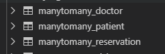
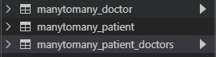
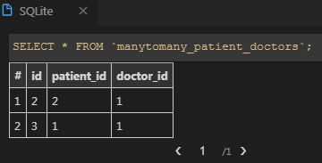
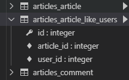

## Model Relationships

- 현재 User와 Article의 관계는 User :  Article = 1: N 이다
- [참조] article.user
- [역참조] user.article_set
- 관점을 조금 바꿔서, User : Article = M : N으로 설정하고 다시 생각해보자. 유저와 게시글 관계에서 서로 좋아요를 표현할 수 있다고 생각해보자
  - User는 여러 개의 게시글에 Like를 할수 있고
  - Article은 여러 명의 User로 부터 Like를 받을 수 있다

#### Many to One

```bash
#05_django (master)
$ cd 05_model_relation/

#05_django/05_model_relation (master)
$ django-admin startproject config .
$ python manage.py startapp manytoone
```

- manytoone > models.py :class 추가

  ```python
  from django.db import models
  
  # Create your models here.
  class User(models.Model):
      name = models.TextField()
  
      def __str__(self):
          return f'{self.name}'
  
  class Article(models.Model):
      title = models.TextField()
      user = models.ForeignKey(User, on_delete=models.CASCADE)
  
      def __str__(self):
          return f'{self.title}'
          
  class Comment(models.Model):
      content = models.TextField()
      article = models.ForeignKey(Article, on_delete=models.CASCADE)
      user = models.ForeignKey(User, on_delete=models.CASCADE)
  
      def __str__(self):
          return f'{self.content}'
          
  ```

  ```bash
  #05_django/05_model_relation (master)
  $ python manage.py makemigrations
  $ python manage.py migrate
  ```

  ```bash
  #05_django/05_model_relation (master)
  $ python manage.py shell_plus
  
  user1 = User.objects.create(name='Kim')
  user2 = User.objects.create(name='Lee')
  article1 = Article.objects.create(title='1글', user=user1)
  article2 = Article.objects.create(title='2글', user=user1)
  article3 = Article.objects.create(title='3글', user=user2)
  c1 = Comment.objects.create(content='1글1댓글', user=user1, article=article1)
  c2 = Comment.objects.create(content='1글2댓글', user=user2, article=article1)
  c3 = Comment.objects.create(content='1글3댓글', user=user1, article=article1)
  c4 = Comment.objects.create(content='1글4댓글', user=user2, article=article1)
  c5 = Comment.objects.create(content='2글1댓글', user=user1, article=article2)
  c6 = Comment.objects.create(content='!1글5댓글', user=user2, article=article1)
  c7 = Comment.objects.create(content='!2글2댓글', user=user2, article=article2)
  ```

```python

In [  ]: for article in user1.article_set.all():
    ...:     for comment in article.comment_set.all():
    ...:         print(comment.content)
1글1댓글
1글2댓글
1글3댓글
1글4댓글
!1글5댓글
2글1댓글
!2글2댓글

In []: c2.user.pk
Out[]: 2
#4. 2번 댓글을 작성한 User의 이름은?
In []: c2.user.name
Out[]: <User: Lee>
#5. 2번 댓글을 작성한 사람의 모든 게시글은?
In []: c2.user.article_set.all()
Out[]: <QuerySet [<Article: 3글>]>
#6. 1번 글의 첫번째 댓글을 작설한 사람의 이름은?
In []: article1.comment_set.first().user.name
Out[]: 'Kim'
#7. 1번 글의 2번째부터 4번째 까지 댓글 가져오기
In []: article1.comment_set.all()[1:4]
Out[]: <QuerySet [<Comment: 1글2댓글>, <Comment: 1글3댓글>, <Comment: 1글4댓글>]>

In []: print(article1.comment_set.all()[1:4].query)
SELECT "manytoone_comment"."id", "manytoone_comment"."content", "manytoone_comment"."article_id", "manytoone_comment"."user_id" FROM "manytoone_comment" WHERE "manytoone_comment"."article_id" = 1  LIMIT 3 OFFSET 1
#8. 1번 글의 첫번째, 두번째 댓글 가져오기
In []: article1.comment_set.all()[0:2]
Out[]: <QuerySet [<Comment: 1글1댓글>, <Comment: 1글2댓글>]>
#9.1번글의 두번째 댓글을 작성한 사람의 첫번째 게시물의 작성자의 이름은?
In []: article1.comment_set.all()[1].user.article_set.all()[0]
    ...: .user.name
Out[]: 'Lee'
#10.1번 댓글의 user정보만 가져오면?
In []: Comment.objects.values('user').get(pk=1)
Out[]: {'user': 1}
#11.2번 사람이 작성한 댓글을 PK 내림차순으로 가져오면?
In []: user2.comment_set.order_by('-pk')
Out[]: <QuerySet [<Comment: !2글2댓글>, <Comment: !1
글5댓글>, <Comment: 1글4댓글>, <Comment: 1글2댓글>]>
#12. 제목이 '1글'이라는 게시글을 전부 가져오면?
In []: Article.objects.filter(title='1글')
Out[]: <QuerySet [<Article: 1글>]>

```


#### Many to Many

- 중개 모델 생성
  - 1:N으로만 구현하려니 예약정보 시스템을 표현하기 어렵다
  - 중개 모델(class Reservation)을 만들어서 Doctor와 Patient를 이어주는 예약정보를 담아보자

- through 옵션

  - Patient입장에서 중개 모델을 거쳐서 reservation_set 형태로 예약정보를 가져오는 것은 불편하다
    - 마찬가지로 Doctor도 reservation_set 형태로 예약정보를 먼저 불러온 뒤에 Patient정보를 가져올수 있다

  - Doctor정보를 중개 모델을 거치지 않고 다이렉트로 가져와 보자

  ```python
  class Doctor(models.Model):
      name = models.TextField()
      
  class Patient(models.Model):
      name = models.TextField()   
      doctors = models.ManyToManyField(Doctor, through='Reservation')
  ```

  

-  related_name 옵션

  - 이제 Patient 입장에서는 patient.doctors.all()과 같은 형태로 쉽게 Doctor정보를 가져올 수 있다
  - 마찬가지로 Doctor에서도 doctor.patients.all()과 같은 형태로 Patient정보를 가져올 수 있게, related_name 옵션을 사용해보자

  ```python
  class Doctor(models.Model):
      name = models.TextField()
  
  class Patient(models.Model):
      name = models.TextField()
      doctors = models.ManyToManyField(Doctor, through='Reservation', related_name="patients")
  ```

  

##### 실습

```bash
#05_django/05_model_relation (master)
$ python manage.py startapp manytomany
```

```python
from django.db import models

# Create your models here.
class Doctor(models.Model):
    name = models.TextField()

    def __str__(self):
        return f'{self.pk}번 의사 {self.name}'

class Patient(models.Model):
    name = models.TextField()
    #doctor = models.ForeignKey(Doctor,on_delete=models.CASCADE)
    doctors = models.ManyToManyField(Doctor, through='Reservation')

    def __str__(self):
        return f'{self.pk}번 환자 {self.name}'

class Reservation(models.Model):
    doctor = models.ForeignKey(Doctor,on_delete=models.CASCADE)
    patient = models.ForeignKey(Patient, on_delete=models.CASCADE)
    def __str__(self):
        return f'{self.doctor.id}의사의 {self.patient.id}번 환자'
    
```

```bash
$ python manage.py shell_plus
```

```python
In []: doctor1 = Doctor.objects.create(name='도현')
In []: doctor2 = Doctor.objects.create(name='은애')

In []: patient1 = Patient.objects.create(name='민승')
In []: patient2 = Patient.objects.create(name='세환')

In []: Reservation.objects.create(doctor=doctor1, patient=patient2)
Out[]: <Reservation: Reservation object (1)>

In []: Reservation.objects.create(doctor=doctor2, patient=patient2)
Out[]: <Reservation: Reservation object (2)>

In []: Reservation.objects.get(pk=1)
Out[]: <Reservation: 1의사의 4번 환자>
        
In []: patient1 = Patient.objects.get(pk=1)
In []: patient1.doctors.all()
Out[]: <QuerySet []>
    
```

- models.py 수정
  - doctors = models.ManyToManyField(Doctor, through='Reservation', related_name="patients")

```python
from django.db import models

# Create your models here.
class Doctor(models.Model):
    name = models.TextField()

    def __str__(self):
        return f'{self.pk}번 의사 {self.name}'

class Patient(models.Model):
    name = models.TextField()
    #doctor = models.ForeignKey(Doctor,on_delete=models.CASCADE)
    #doctors = models.ManyToManyField(Doctor, through='Reservation')
    #참조로 조회할 수 있게 설정 through=...
    #역참조로 조회할 수 있게 설정 related_name=...
    doctors = models.ManyToManyField(Doctor, through='Reservation', related_name="patients")

    def __str__(self):
        return f'{self.pk}번 환자 {self.name}'

class Reservation(models.Model):
    doctor = models.ForeignKey(Doctor,on_delete=models.CASCADE)
    patient = models.ForeignKey(Patient, on_delete=models.CASCADE)
    def __str__(self):
        return f'{self.doctor.id}의사의 {self.patient.id}번 환자'
    
    
```



- 단순히 테이블간 N:M 관계 설정만 필요한 경우 django

  모델에 ManyToManyField() 설정만으로 자동으로 관계 테이블 생성됨

  - 어플리케이션 내에 db.sqlite3, migrations내에 0001...파일 삭제

	- models.py 내에 Reservation class 삭제
	
	- models.py 아래와 같이 수정
	
	  ```python
	  class Patient(models.Model):
	      name = models.TextField()
	      doctors = models.ManyToManyField(Doctor, related_name="patients")
	  
	      def __str__(self):
	          return f'{self.pk}번 환자 {self.name}'
	  ```
	
	  
	
	- makemigrations, migrate 실행하면 아래와 같이 자동으로관계테이블 생성됨
	
	
	
	

```bash
$ python manage.py shell_plus
```

```python
In []: doctor1.patients.add(patient1)

In []: doctor1.patients.all()
Out[]: <QuerySet [<Patient: 1번 환자 민승>]>

In []: doctor1.patients.add(patient2)

In []: doctor1.patients.all()
Out[]: <QuerySet [<Patient: 1번 환자 민승>, <Patient: 2번 환자 세환>]>

In []: doctor1.patients.remove(patient1)

In []: doctor1.patients.all()
Out[]: <QuerySet [<Patient: 2번 환자 세환>]>
```

---

## Like / Profile /  Follow

#### Like

> User는 여러개의 Article에 좋아요 표시할 수 있고, `Article`은 여러명의 User에게 좋아요를 받을 수 있다

##### Model 설정

  - blank = True

    - 최초 작성되는 글에는 좋아요 없고, 글이 작성되더라도 좋아요를 받지 못할 수 있다
    - 이 옵션을 줘서 유효성 검사를 통과한다
    - 실제 데이터베이스는 null이 들어가는게 아니라 빈 스트링('')형태가 들어간다

    ```python
    #articles/models.py
    class Article(models.Model):
        title = models.CharField(max_length=40)
        content = models.TextField()
        created_at = models.DateTimeField(auto_now_add=True)
        updated_at = models.DateTimeField(auto_now=True)
        user = models.ForeignKey(settings.AUTH_USER_MODEL,on_delete=models.CASCADE)
        like_users = models.ManyToManyField(settings.AUTH_USER_MODEL, related_name='like_articles', blank=True)
        
        # 객체 표시 형식 
        def __str__(self):
             return f'[{self.pk}번글]: {self.title}|{self.content}'
    
    ```
	- related_name 설정은 필수
		- `like_users` 필드에 related_name을 쓰지 않으면,User입장에서 article_set을 사용할 경우 user필드를 갖고올지 like_users필드를 갖고 올지 인식하지 못한다
		- related_name 설정과 함께 해당 필드는 article_set과 같은 방식으로 호출하지 못하고, like_users방식으로 호출해야 한다
	- 사용할 수 있는 기능
		- user.article_set.all() : 유저가 작성한 게시글 전부
		- user.like_articles.all() : 유저가 좋아요 누른 게시글 전부
		- article.user :게시글 작성한 유저, 1:N
		- article.like_users : 게시글 좋아요 누른 유저 전부 , M:N
	
    ```bash
    #05_django/04_django_form (master)
    $ python manage.py makemigrations
    $ python manage.py migrate
    ```

    

##### View & URL

- exists() & filter()
  - filter() : 특정한 조건에  맞는 레코드들을 가져온다
  - exists() : 최초한 하나의 레코드가 존재하는지 여부를 말해준다

- get() vs filter() -> 데이터가 없는 경우 에러 여부

  ```python
  #articles/views.py
  from django.contrib.auth.decorators import login_required
  ...
  
  @login_required
  def like(request, article_pk):
      #게시글 가져오기
      article = get_object_or_404(Article, pk=article_pk)
      #현재 접속하고 있는 유저
      user = request.user
  
      #현재 게시글을 좋아요 누른 사람 목록에 현재 접속한 유저가 있을 경우 -> 좋아요 취소
      if article.like_users.filter(pk=user.pk).exists():
          article.like_users.remove(user)
      else:#목록에 없을 경우 좋아요 저장
          article.like_users.add(user)
      
      return redirect('articles:index')
  
  ```
  ```python
  #articles/urls.py
  urlpatterns = [
      ...    path('<int:article_pk>/like/',views.like,name='like'),
  ]
  ```

##### Fontawesome 아이콘적용

- https://fontawesome.com/ 가입 후

- Kits 받기
- config/base.html 추가

```html
<head>
...
<!-- FontAwesome -->
<script src="https://kit.fontawesome.com/<발급받은Kits코드>.js" crossorigin="anonymous"></script>
</head>
```

##### Template 분리

- 모듈화한 템플릿은 제목 앞에 언더스코어(_) 붙여주는 것이 코딩 컨벤션

- Bootstrap Card 컴포넌트를 사욯해서 꾸미기
  - config/articles/_article.html 추가

  ```django
  
    <div class="col-12 col-md-6 mb-3">
      <div class="card">
        <div class="card-body">
          <h5 class="card-title">{{article.title}}</h5>
          <p class="card-text">
          <a href="">
          <!--사용자가 좋아요 누른 상태 - 꽉찬하트-->
          
            <i class="fas fa-heart"></i>
          
          <!--좋아요 안 누른상태 - 빈하트-->
            <i class="far fa-heart"></i>
          
          
          </a>     
          {{article.like_users.all|length}}명이 이 글을 좋아합니다.<br>
          {{article.created_at}}
          </p>
          <a href="" class="btn btn-primary">상세보기</a>
        </div>
      </div>
    </div>
  
  ```

  - config/articles/index.html 수정

  ```django
  
  
  
    <br>
    <h1>Articles</h1>
    <hr>
  
    <a href="">[NEW]</a>
    <hr>
    
    <!-- 모듈화 시켜둔 article 템플릿 가져오기 -->
    
    
  
  ```

#### Profile 페이지

> 각 유저마다 프로필 페이지를 만들자

##### View & URL

- User에 대한 CRUD로직 대부분을 accounts앱에서 구현 했으므로, Profile 페이지 역시 accounts앱에 구현해보자

  - accounts/views.py :함수추가

  ```python
  from django.shortcuts import render, redirect, get_object_or_404
  from django.contrib.auth import get_user_model
  ...
  
  #프로필
  def profile(request, username):
      person = get_object_or_404(get_user_model(),username=username)
      context = {'person': person}
      return render(request, 'accounts/profile.html',context)
      
  ```
  - urls.py
  ```python
  from django.urls import path
  from . import views
  
  app_name = 'accounts'
  urlpatterns = [
      ...
      path('<str:username>/',views.profile, name='profile'),
  ]
  ```

  - profile.html
  
  ```html
  
  
  
  <h1>{{person.username}}님의 Profile</h1>
  <hr>
  <h3>{{person.username}}님이 작성한 게시글</h3>
  <div class="row">
  
    <div class="col-12 col-md-6 mb-3">
      <div class="card">
        <div class="card-body">
          <h5 class="card-title">{{article.title}}</h5>
          <p class="card-text">        
          {{article.like_users.all|length}}명이 이 글을 좋아합니다.<br>
          {{article.created_at}}
          </p>
          <a href="" class="btn btn-primary">상세보기</a>
        </div>
      </div>
    </div>
  
  </div>
  <br>
  <h3>{{person.username}}님이 작성한 댓글</h3>
  <div class="row">
  
  <div class="col-12 col-md-6 mb-3">
    <div class="card">
      <div class="card-body">
        {{comment.content}}<b>
        <small>{{comment.created_at|date:"SHORT_DATETIME_FORMAT"}}</small>
        <a href="" class="btn-primary">게시글 확인</a>
      </div>
    </div>
  </div>
  
  </div>
  
  ```

#### 상단메뉴 Template 분리

- config/templates/_nav.html 추가

```html

<nav class="navbar navbar-expand-lg navbar-dark bg-dark">
  <a class="navbar-brand" href="">&nbsp;Hello, {{user.username}}</a>
  <button class="navbar-toggler" type="button" data-toggle="collapse" data-target="#navbarNav" aria-controls="navbarNav" aria-expanded="false" aria-label="Toggle navigation">
    <span class="navbar-toggler-icon"></span>
  </button>
  <div class="collapse navbar-collapse" id="navbarNav">
    <ul class="navbar-nav">
       
        <li class="nav-item">
          <a class="nav-link" href="">좋은글보기</a>
        </li>   
        <li class="nav-item">
          <a class="nav-link" href="">전부보기</a>
        </li>  
        <li class="nav-item">
          <a class="nav-link" href="">마이페이지</a>
        </li>
        <li class="nav-item">
          <a class="nav-link" href="">정보수정</a>
        </li>
        <li class="nav-item">
          <a class="nav-link" href="">암호변경</a>
        </li>        
        <li class="nav-item ">
          <a class="nav-link" href="">로그아웃</a>
        </li>
        <form action="" method="POST" style="display: inline;">
          
          <input type="submit" value="회원탈퇴" class="btn btn-danger">
        </form>
      
        <li class="nav-item active">
          <a class="nav-link" href="">로그인</a>
        </li>
        <li class="nav-item">
          <a class="nav-link" href="">회원가입</a>
        </li>
      

     
    </ul>
  </div>
</nav>
```

- config/templates/base.html 수정

```html


<!DOCTYPE html>
<html lang="en">
<head>
  <meta charset="UTF-8">
  <meta name="viewport" content="width=device-width, initial-scale=1.0">
  <meta http-equiv="X-UA-Compatible" content="ie=edge">
  <title>04_django_form</title>

<!-- FontAwesome -->
<script src="https://kit.fontawesome.com/a84f15c24e.js" crossorigin="anonymous"></script>
</head>
<body>
  
  <div class="container">
   
    
    
  </div>


</body>
</html>
```


#### Follow

- Follow는 User와 User의 M:N 관계다
- 장고가 제공하고 있는 User 모델을 대체해서 사용한다. User 모델을 만드는게 아니라 , 장고가 자신만의 User모델을 만들 수 잇도록 제공해준다
  - AbstractUser

##### User 모델 대체하기

- accounts/models.py : class 생성

```python
from django.db import models
from django.contrib.auth.models import AbstractUser
from django.conf import settings

# Create your models here.
class User(AbstractUser):
    followers = models.ManyToManyField(settings.AUTH_USER_MODEL, related_name='followings')
```
- config/settings.py :항목추가
```python
#기본값: auth.User
AUTH_USER_MODEL = 'accounts.User'
```

- migrations폴더내에 0001...파일삭제, db.sqlite3 삭제
- makemigrations, migrate 실행

```bash
#05_django/04_django_form (master)
$ python manage.py makemigrations
$ python manage.py migrate
$ python manage.py createsuperuser
```
- accounts/admin.py 수정
```python
from django.contrib import admin
from django.contrib.auth.admin import UserAdmin
from .models import User

# Register your models here.
admin.site.register(User, UserAdmin)

```

##### Detail화면에 follow 기능추가

- articles/views.py : follow() 함수추가

```python
@login_required
def follow(request, article_pk, user_pk):
    #게시글 작성한 유저
    person = get_object_or_404(get_user_model(), pk=user_pk)
    #지금 접속하고 있는 유저
    user = request.user

    if person != user:
        if user in person.followers.all:# -> unfollow
            person.followers.remove(user)    
        else: # -> follow
            person.followers.add(user)

    return redirect('articles:detail',article_pk)

def detail(request, article_pk):
    # article = Article.objects.get(pk=article_pk)
    article = get_object_or_404(Article, pk=article_pk)

    person = get_object_or_404(get_user_model(),pk=article.user_id)
    comment_form = CommentForm()
    comments = article.comment_set.all()

    context = {
        'article':article,
        'person':person,
        'comment_form':comment_form,
        'comments':comments
        } 
    return render(request, 'articles/detail.html', context)

```

- articles/_follow.html 화면 추가

```python
<div class="jumbotron">
  <h1 class="display-4">{{person.username}}</h1>
  <p class="lead">
    팔로워:{{person.followers.all|length}}명 | 팔로잉:{{person.followings.all|length}}명
  </p>
  <hr class="my-4">
  <p></p>
  
    <a class="btn btn-primary btn-lg" href="" role="button">
    
      Unfollow
    
      follow
    
    </a>
  
</div>
```

##### 팔로우 하는 모든 글 조회

- articles/views.py : 함수추가

```python
#내가 팔로우 하는 사람의 글 + 내가 작성한 글
def list(request):
    #내가 팔로우하고 있는 사람들
    followings = request.user.followings.all()
    #내가 팔로우하고 있는 사람들 + 나 -> 합치기
    followings = chain(followings, [request.user])
    #위 명단 사람들 게시글 가져오기 
    articles = Article.objects.filter(user__in=followings).order_by('-pk').all()
    comment_form = CommentForm()
    context = {
        'articles':articles,
        'comment_form':comment_form,
    }
    return render(request, 'articles/article_list.html' , context)

def explore(request):
    articles = Article.objects.all()
    comment_form = CommentForm()
    context = {
        'articles':articles,
        'comment_form':comment_form,
    }
    return render(request, 'articles/article_list.html' , context)
```

- articles/urls.py

```python
from django.urls import path
from . import views

app_name = 'articles'
urlpatterns = [
    ...
    path('list/',views.list,name="list"),
    path('explore/',views.explore,name='explore'),
]
```

- config/articles/article_list.html

```html




<!--URL Resolver를 사용해서 제목값 분기-->

<h1>List</h1>

<h1>Explore</h1>


  <p>글 제목: {{article.title}}</p>
  <p>글 내용: {{article.content}}</p>
  <hr>
  <form action="" method="POST">
  
  
  
  </form>
  <hr>


```

- _nav.html 수정 :메뉴 추가

```html
....
<li class="nav-item">
    <a class="nav-link" href="">좋은글보기</a>
</li>   
<li class="nav-item">
    <a class="nav-link" href="">전부보기</a>
</li>  
```


