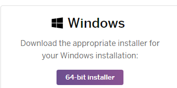
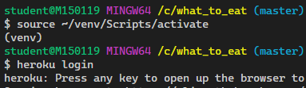

## Heroku 배포

### 1. 사전준비

#### 1.1 Github Repo 생성

- 배포할 프로젝트 하나만 관리하고 있는 폴더로 진행해야 함

- github site에 프로젝트 배포를 위한 저장소 새로 생성 ex) django-deploy
- gitignore 파일 생성 (https://www.gitignore.io/api/venv,django,visualstudiocode)
    - .gitignore 파일에 내용추가
    ```
    ...
    *.bak
    *.sqlite3
    .venv
    ```


#### 1.2 환경변수 관리

```bash
$ pip install python-decouple
```

- 프로젝트 폴더 내에 .env 파일생성

```
SECRET_KEY='장고 SECRET_KEY 설정'
DEBUG=True
```
- settings.py 수정
```python
from decouple import config
...
# SECURITY WARNING: keep the secret key used in production secret!
SECRET_KEY = config('SECRET_KEY')

# SECURITY WARNING: don't run with debug turned on in production!
DEBUG = config('DEBUG')
```

#### 1.3 django-heroku 설치

```bash
#what_to_eat 프로젝트 내에
$ pip install django-heroku
```
- settings.py heroku 설정추가
```python
#heroku settings
import django_heroku
django_heroku.settings(locals())
```


### 2. 배포설정

### 2.1 Procfile 

- 프로젝트 최상위 폴더에 Procfile 파일생성
```
web: gunicorn config.wsgi --log-file -
```
- gunicorn 설치
```bash
#what_to_eat (master)
$ pip install gunicorn
```

- 프로젝트 최상위 폴더에 runtime.txt 파일생성

```
python-3.7.4
```

- requirements 파일 새로 생성
```bash
#what_to_eat (master)
$ pip freeze > requirements.txt
```


### 3. 배포

- herocu cli 검색 (https://devcenter.heroku.com/articles/heroku-cli)
- herocu 64bit 설치
  

  -> 설치하면 herocu cli 기반으로 사용할 수 있음

- VS Code 재실행 후

- 터미널에서 heroku login 입력



```bash
# 프로젝트 폴더 내에서 ex)what_to_eat
$ heroku config:set SECRET_KEY='<SECRET_KEY입력>'
$ heroku config:set DEBUG=True
#$ heroku config:set DISABLE_COLLECTSTATIC=1
```

- 위 설정이 안될 경우
- heroku.com 대시보드 > Settings > Reveal Config Vars버튼 클릭

- SECRET_KEY 설정


```bash
$ heroku --version
heroku/7.35.0 win32-x64 node-v12.13.0
```
- heroku 서버에 배포
```bash
#what_to_eat (master)
$ git push heroku master
```

- db가 sqlite 인경우 migrate

```bash
$ heroku run python manage.py makemigrations
$ heroku run python manage.py migrate
```


- config/settings.py : 도메인 설정

```python
#heroku full name 설정
ALLOWED_HOSTS = ['sleepy-thicket-13178.herokuapp.com']
```

```bash
#heroku 서버에 배포
$ git push heroku master
```


- heroku에 배포시에 아래와 같이 오류발생할 경우

```bash
$ git push heroku master
fatal: 'heroku' does not appear to be a git repository
fatal: Could not read from remote repository.
```

- 다음 명령어 실행 후 서버배포

```bash
$ heroku git:remote -a <yourapp>
$ git push heroku master
```

