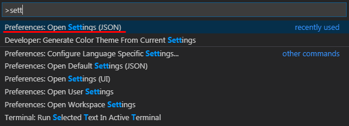

## 2019.11.01
## 종합 실습 프로젝트 #01
[실습 상세 내용](./191101_PJT01.pdf)


---
### VS Code 툴 에러표시 문제 해결
- 파이썬 파일에 model 정보에 빨간줄 표시 안보이게 처리
- pylint-django 설치
```bash
#05_django (master)
$ pip install pylint-django
```
- ctrl + shift + p > Preferences: Open Settings (JSON) 선택


- settings.json 추가
```json
{
...
    "python.linting.pylintArgs":[
        "--load-plugins=pylint_django",
        "--errors-only",
    ]
}
```